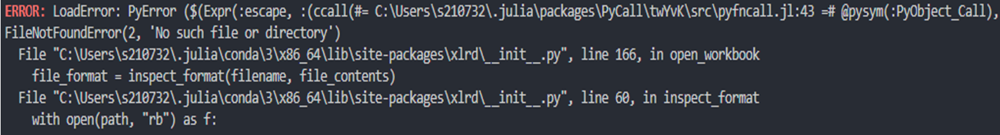
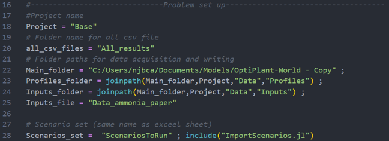
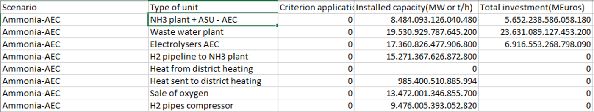
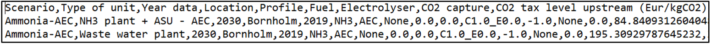
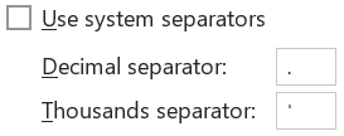
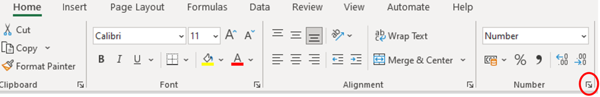
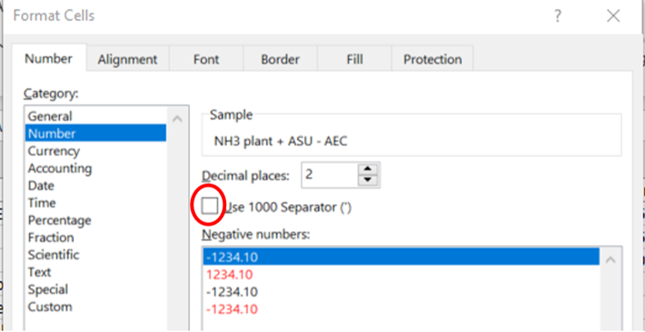
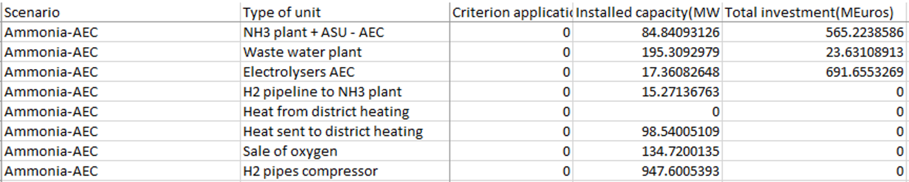

# Examples and Troubleshooting

## Common Errors

### Package Not Found


Solution:
```julia
] activate env
add [PACKAGE_NAME]
```

### File Not Found





Check all paths in Main.jl are correct.

### Excel Format Error



CSV uses commas and dots:



Fix Excel settings:







Results should be correct:

