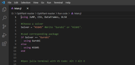

# OptiPlant Documentation

OptiPlant is a linear optimization model that minimizes the investment and operation costs of a power-to-X (PtX) system powered by wind, solar and/or the electricity grid.

## Overview

The model operates under a "dynamic power supply and system optimization" approach (DPS-Syst-Opt) with perfect foresight. It sizes units and schedules hourly mass/energy flows to meet a yearly fuel demand at minimum cost.

Typical solving time on a personal computer is usually below 5 minutes using an open-source solver.

## Key Features

- Linear deterministic programming with perfect foresight
- Supports power supply from wind, solar, and the grid
- Fast solve times (often <5 minutes with open-source solver)
- Simple workflow: prepare data in Excel, run Julia code, review results in CSV/Excel

## About OptiPlant

OptiPlant is developed by Nicolas Campion (DTU Department of Technology, Management and Economics) to model PtX fuel production systems.

### Supported Technologies
- Wind profiles
- Solar profiles  
- Electricity grid (hourly buy price)

### Fuel Types
- NH₃ (ammonia)
- H₂ (hydrogen) 
- MeOH (methanol)

### Scientific Reference

Nicolas Campion et al. "Techno-economic assessment of green ammonia production with different wind and solar potentials." Renewable Sustainable Energy Reviews 173 (2023). DOI: 10.1016/j.rser.2022.113057.

[Link to paper](https://www.sciencedirect.com/science/article/pii/S1364032122009388)