# Installation Guide

## Julia Installation

Go to https://julialang.org/downloads/ and download Julia for your operating system.

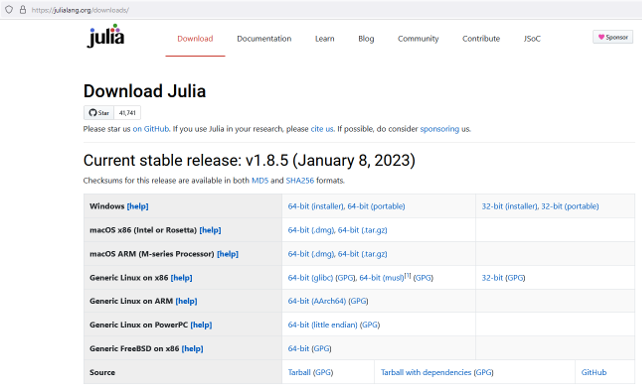

Run the installer:

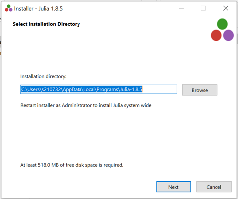

Tick "Add Julia to PATH" if you have VS Code installed.

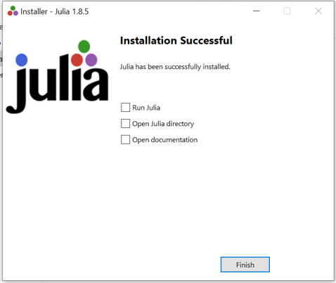

## VS Code Installation

Download from https://code.visualstudio.com/Download

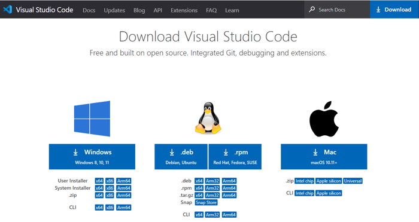

Run installer:

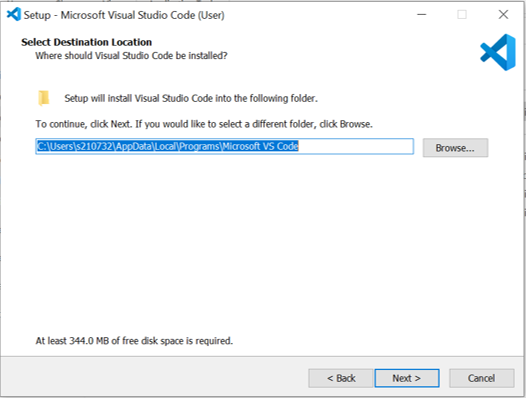

Important: Tick "Add to PATH":

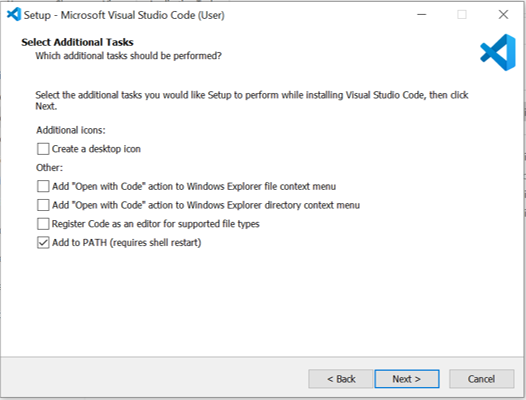

Success message:

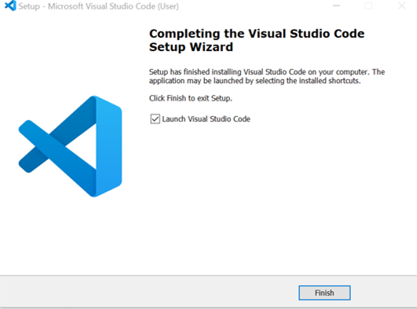

## Julia Extension

Install Julia extension:

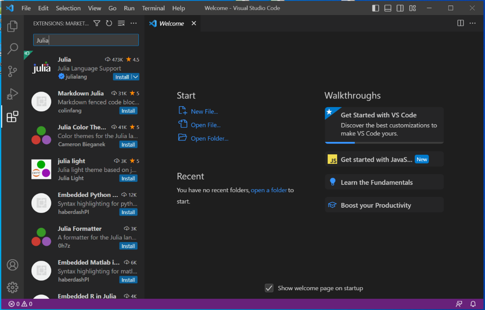

Search and install:

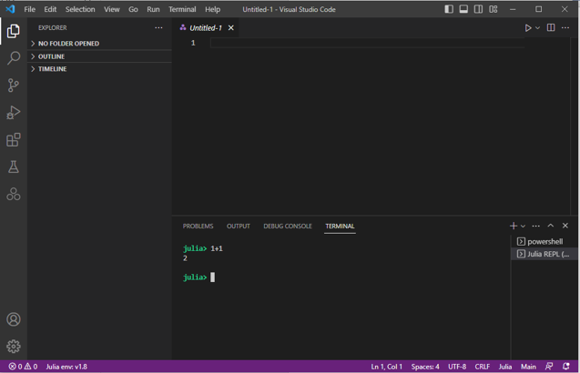

Start Julia REPL with Ctrl+Shift+P:

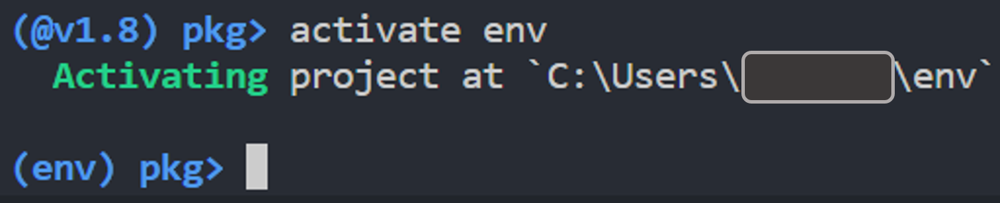

## Package Installation

Enter package manager with "]":

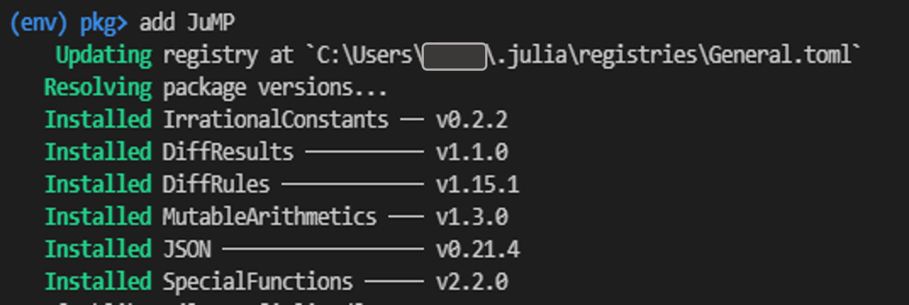

Required packages:
```julia
] activate env
add JuMP HiGHS DataFrames CSV XLSX
```

## Gurobi Setup (Optional)

For Gurobi license:

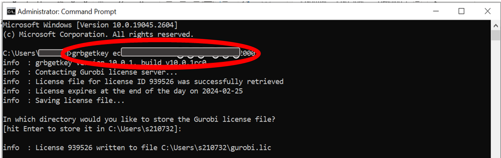

```cmd
grbgetkey [your-key]
```