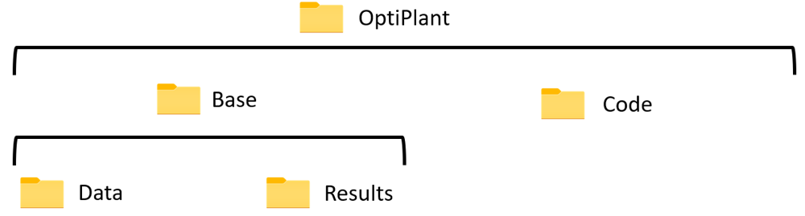

# Installation Guide# Software Installation# Installation Guide#- Software- Installation


## Julia Installation


Go to https://julialang.org/downloads/ and download Julia for your operating system.This guide provides step-by-step instructions for installing all required software to use OptiPlant.


Run the installer:## Julia InstallationThis guide will help you install all the required software and packages to run OptiPlant successfully.This- guide- provides- step-by-step- instructions- for- installing- all- required- software- to- use- OptiPlant.


Tick "Add Julia to PATH" if you have VS Code installed.### Required Julia Version


## VS Code InstallationPackage manager prompt in screenshots shows "(@v1.8) pkg>", indicating examples use Julia v1.8 environment.## Overview##- Julia- Installation


Download from https://code.visualstudio.com/Download


### Step-by-Step Julia Installation Process


Run installer:


1. Go to https://julialang.org/downloads/ and download the Julia version corresponding to your operating systemOptiPlant requires:###- Download- Julia


Important: Tick "Add to PATH":


1. **Julia** (programming language and environment)


Success message:*Figure 3: Julia download page*


2. **Visual Studio Code** (code editor with Julia extension)1.- Go- to- https://julialang.org/downloads/


## Julia Extension2. Run the Julia installer and install the program


Install Julia extension:3. **Julia packages** (optimization and data handling libraries)2.- Download- the- Julia- version- corresponding- to- your- operating- system


Search and install:*Figure 4: Julia installer steps*4. **Microsoft Excel** (for input preparation and results visualization)3.- Run- the- Julia- installer- and- install- the- program


Start Julia REPL with Ctrl+Shift+P:3. **Important**: Tick the box "Add Julia to PATH" only if you already have Visual Studio Code already installed on your PC


## Package Installation4. If the installation is successful, the message will appear: "You just got Julia on your PC!"###- Installation- Options


Enter package manager with "]":


Required packages:*Figure 5: Successful installation screen*

```julia

] activate env## 1. Julia Installation**Important:**- Tick- the- box- "Add- Julia- to- PATH"- **only- if**- you- already- have- Visual- Studio- Code- installed- on- your- PC.

add JuMP HiGHS DataFrames CSV XLSX

```### System Requirements


## Gurobi Setup (Optional)


For Gurobi license:Not specified in the presentation.


### Download and Install Julia###- Verification


```cmd### Verification Steps

grbgetkey [your-key]

```

Successful installation screen: "You just got Julia on your PC!"

1. Go to [https://julialang.org/downloads/](https://julialang.org/downloads/)If- the- installation- is- successful,- you- will- see- the- message:- **"You- just- got- Julia- on- your- PC!"**

## VS Code Installation

2. Download the Julia version corresponding to your operating system

### VS Code Setup Instructions

*Note:- Examples- in- this- guide- use- Julia- v1.8- environment- as- shown- in- package- manager- prompts.*

1. Go to https://code.visualstudio.com/Download and download the version for your operating system


*Figure 6: VS Code download page*##- VS- Code- Installation


2. Run the installer and install the program3. Run the Julia installer and install the program


4. **Important**: Tick the box "Add Julia to PATH" only if you already have Visual Studio Code installed on your PC###- Download- VS- Code

*Figure 7: VS Code installer*


3. **Important**: During installation, tick "Add to PATH (requires shell restart)"

1.- Go- to- https://code.visualstudio.com/Download


*Figure 8: VS Code "Add to PATH" option*2.- Download- the- version- for- your- operating- system


4. If successful, message shown: "You just got VS Code on your PC! Next step is to add the corresponding extensions and save them in an 'environment'."5. If the installation is successful, you will see: "You just got Julia on your PC!"3.- Run- the- installer- and- install- the- program


*Figure 9: VS Code installation success message*

###- Installation- Configuration

### Required Extensions


"Julia" extension in VS Code (provides Julia language support and a Julia REPL).

### System Requirements**Critical:**- During- installation,- tick- **"Add- to- PATH- (requires- shell- restart)"**

### Configuration Steps


1. Open VS Code → View > Extensions → search "Julia" → Install

Julia works on:###- Verification


*Figure 10: VS Code Extensions view for "Julia"*- **Windows**: Windows 10 or later


2. Start Julia REPL each session via Command Palette: press "Ctrl+Shift+P", type "Start Julia" or "Julia: Start REPL"- **macOS**: macOS 10.14 or later  If- successful,- you- will- see- the- message:- **"You- just- got- VS- Code- on- your- PC!- Next- step- is- to- add- the- corresponding- extensions- and- save- them- in- an- 'environment'."**


- **Linux**: Recent distributions with glibc 2.17 or later

*Figure 11: Command Palette showing "Julia: Start REPL"*

##- VS- Code- Configuration

### Integration with Julia

## 2. Visual Studio Code Installation

The Julia extension integrates the REPL (console) inside VS Code, enabling executing Julia code and interacting with the package manager.

###- Install- Julia- Extension

## Packages Installation

### Download and Install VS Code

### Required Julia Packages List

1.- Open- VS- Code

- **JuMP** (formulate optimization problems)

- **HiGHS or Gurobi** (LP solvers; only one is required)1. Go to [https://code.visualstudio.com/Download](https://code.visualstudio.com/Download)2.- Go- to- **View- >- Extensions**- 

- **DataFrames** (structured data)

- **CSV** (read CSV files)2. Download the version for your operating system3.- Search- **"Julia"**

- **XLSX** (read Excel .xlsx files)

- **Optional for plotting/visualization**: Plots, StatsPlots, PrettyTables4.- Install- the- Julia- extension


### Installation Commands


1. Enter package manager by pressing "]" in the Julia REPL (prompt changes from "julia>" to something like "(@v1.8) pkg>")###- Start- Julia- REPL


3. Run the installer and install the program

*Figure 12: Package manager prompts illustrating activation*

4. **Important**: During installation, tick "Add to PATH (requires shell restart)"Each- session,- start- the- Julia- REPL- via- Command- Palette:

2. Activate environment: type "activate env" (prompt changes to "(env) pkg>" and creates/switches to folder env)

1.- Press- **Ctrl+Shift+P**


*Figure 13: Adding packages in activated environment*2.- Type- **"Start- Julia"**- or- **"Julia:- Start- REPL"**


3. Install packages: type "add PACKAGE_NAME" (e.g., "add JuMP", "add HiGHS", "add DataFrames", "add CSV", "add XLSX")


4. Check installed packages: type "status" (run after activating env)5. If successful, you will see: "You just got VS Code on your PC! Next step is to add the corresponding extensions and save them in an 'environment'."The- Julia- extension- integrates- the- REPL- (console)- inside- VS- Code,- enabling- executing- Julia- code- and- interacting- with- the- package- manager.


### Solver Setup (Gurobi, HiGHS, etc.)


#### HiGHS (Recommended)##- Package- Installation

**HiGHS**: Recommended open-source solver for OptiPlant. Install via "add HiGHS".


#### Gurobi (Optional, Commercial)

**Gurobi** (optional, commercial; faster alternative; same results as HiGHS):### Install Julia Extension###- Required- Julia- Packages


1. Get a license via https://www.gurobi.com/ (Downloads & Licenses). After registration, obtain the grbgetkey

2. Install the latest optimizer from https://www.gurobi.com/downloads/gurobi-optimizer-eula/

3. Restart system if not done automatically1. Open Visual Studio CodeOptiPlant- requires- the- following- packages:

4. Open Command Prompt and enter the saved key: "grbgetkey" and save the license in the default location

2. Go to **View → Extensions** (or press `Ctrl+Shift+X`)


*Figure 14: Command Prompt example with "grbgetkey ..." usage*3. Search for "Julia"-- **JuMP**- -- Formulate- optimization- problems


5. In Julia package manager, "add Gurobi"4. Install the Julia extension (provides Julia language support and REPL)-- **HiGHS**- or- **Gurobi**- -- LP- solvers- (only- one- required)


### Dependency Management-- **DataFrames**- -- Structured- data- handling


Use Julia environments. Activate an "env" environment and install required packages into it. Use "status" to verify.-- **CSV**- -- Read- CSV- files


### Troubleshooting Package Issues-- **XLSX**- -- Read- Excel- .xlsx- files


If "Package X not found": ensure the environment is activated ("activate env"), verify with "status", install missing package with "add PACKAGE_NAME", and ensure the code calls the package at the top (see Troubleshooting section for details and figure references).### Configure Julia in VS Code


## Installation Problems**Optional- packages**- for- plotting/visualization:


- **Julia or VS Code not recognized**: Ensure "Add to PATH" options were ticked during installation (Julia PATH guidance and VS Code's "Add to PATH (requires shell restart)")Each time you start working with Julia:-- Plots

- **Gurobi license issues**: Ensure you ran "grbgetkey" in Command Prompt and saved license to default location

-- StatsPlots- - 

## Next Steps

1. Press `Ctrl+Shift+P` to open Command Palette-- PrettyTables

Once installation is complete:

2. Type "Start Julia" or "Julia: Start REPL"

1. **[Understand File Structure](usage.md)** - Learn the OptiPlant organization

2. **[Try Examples](Examples.md)** - Run sample scenarios and troubleshooting3. This will start the Julia REPL (console) inside VS Code###- Installation- Steps

3. **[Technical Reference](api.md)** - Detailed specifications and file formats


1.- **Enter- Package- Manager**

- - - 

## 3. Julia Packages Installation- - - Press- `]`- in- the- Julia- REPL.- The- prompt- changes- from- `julia>`- to- something- like- `(@v1.8)- pkg>`.


### Enter Package Manager2.- **Activate- Environment**

- - - 

1. In the Julia REPL, press `]` to enter package manager mode- - - ```julia

2. The prompt will change from `julia>` to something like `(@v1.8) pkg>`- - - activate- env

- - - ```

- - - 

- - - The- prompt- changes- to- `(env)- pkg>`- and- creates/switches- to- folder- env.

### Create and Activate Environment

3.- **Install- Packages**

1. Type: `activate env`- - - 

2. This creates/switches to a folder called "env"- - - Install- each- package- using- the- `add`- command:

3. The prompt changes to `(env) pkg>`- - - ```julia

- - - add- JuMP

- - - add- HiGHS

- - - add- DataFrames

### Install Required Packages- - - add- CSV

- - - add- XLSX

Install the following packages one by one:- - - ```


```julia4.- **Verify- Installation**

add JuMP        # Optimization modeling- - - 

add HiGHS       # Open-source solver (recommended)- - - Check- installed- packages:

add DataFrames  # Structured data handling- - - ```julia

add CSV         # Read CSV files- - - status

add XLSX        # Read Excel files- - - ```

```- - - 

- - - Run- this- command- after- activating- the- env- environment.


##- Solver- Setup

### Optional Packages

###- HiGHS- (Recommended- -- Open- Source)

For plotting and visualization (optional):

```juliaHiGHS- is- the- recommended- open-source- solver- for- OptiPlant.

add Plots

add StatsPlots  **Installation:**

add PrettyTables```julia

```add- HiGHS

```

### Verify Installation

No- additional- configuration- required.

Type `status` to check installed packages:

###- Gurobi- (Optional- -- Commercial)

```

(env) pkg> statusGurobi- is- a- faster- alternative- that- provides- the- same- results- as- HiGHS.

```

####- Gurobi- Installation- Steps

This will show all packages installed in your environment.

1.- **Get- License**

## 4. Solver Setup- - - -- Visit- https://www.gurobi.com/- (Downloads- &- Licenses)

- - - -- Register- and- obtain- the- `grbgetkey`

### HiGHS (Recommended - Open Source)

2.- **Install- Gurobi- Optimizer**

HiGHS is the recommended solver for OptiPlant:- - - -- Download- the- latest- optimizer- from- https://www.gurobi.com/downloads/gurobi-optimizer-eula/

- - - -- Install- the- software

```julia

add HiGHS3.- **Restart- System**

```- - - -- Restart- if- not- done- automatically


**Advantages:**4.- **Activate- License**

- Open-source and free- - - -- Open- Command- Prompt

- Fast performance- - - -- Enter- the- saved- key:- `grbgetkey- <your-key>`

- Same results as commercial alternatives- - - -- Save- the- license- in- the- default- location

- No license required

5.- **Install- Julia- Package**

### Gurobi (Optional - Commercial)- - - ```julia

- - - add- Gurobi

If you prefer Gurobi (commercial solver with identical results):- - - ```


1. Get a license at [https://www.gurobi.com/](https://www.gurobi.com/)##- Dependency- Management

2. After registration, obtain the license key

3. Install the Gurobi Optimizer from [https://www.gurobi.com/downloads/gurobi-optimizer-eula/](https://www.gurobi.com/downloads/gurobi-optimizer-eula/)###- Using- Julia- Environments

4. Restart your system if not done automatically

5. Open Command Prompt and enter the license key:OptiPlant- uses- Julia- environments- for- dependency- management:


```bash1.- **Activate- environment**:- `activate- env`

grbgetkey YOUR_LICENSE_KEY2.- **Install- packages**- into- the- activated- environment

```3.- **Check- status**:- `status`- to- verify- packages

4.- **Activate- each- session**:- Remember- to- activate- the- environment- each- time- you- start- Julia


###- Package- Verification

6. Save the license in the default location

7. In Julia package manager: `add Gurobi`After- installation,- verify- packages- are- available:


**Note**: Both HiGHS and Gurobi provide identical results. HiGHS is recommended as it's open-source.```julia

using- JuMP

## 5. Verification Stepsusing- HiGHS- - #- or- using- Gurobi

using- DataFrames

### Test Julia Installationusing- CSV

using- XLSX

1. Open Julia REPL```

2. Type: `println("Hello OptiPlant!")`

3. You should see the message printed##- Troubleshooting- Installation


### Test Package Installation###- Package- Not- Found- Error


In Julia REPL:**Error:**- `Package- X- not- found`

```julia

using JuMP, HiGHS, DataFrames, CSV, XLSX**Likely- causes:**

println("All packages loaded successfully!")-- Environment- not- activated- before- running- code

```-- Package- not- installed

-- Package- not- called- in- code

### Test VS Code Integration

**Solution:**

1. Create a new file with `.jl` extension1.- In- Julia- REPL,- press- `]`- to- enter- package- manager

2. Write some Julia code2.- Type- `activate- env`

3. Use `Ctrl+Enter` to execute code in the REPL3.- Check- installed- packages- with- `status`

4.- If- missing,- install- with- `add- PACKAGE_NAME`

## Troubleshooting5.- Ensure- code- calls- necessary- packages- at- the- beginning


### Julia Not Recognized###- Installation- Problems


**Problem**: "Julia is not recognized as an internal or external command"**Julia- or- VS- Code- not- recognized:**

-- Ensure- "Add- to- PATH"- options- were- selected- during- installation

**Solution**: -- For- VS- Code:- "Add- to- PATH- (requires- shell- restart)"

- Ensure "Add Julia to PATH" was checked during installation-- For- Julia:- "Add- Julia- to- PATH"- (if- VS- Code- already- installed)

- Restart your computer

- Reinstall Julia with PATH option checked**Gurobi- license- issues:**

-- Ensure- you- ran- `grbgetkey- <your-key>`- in- Command- Prompt

### VS Code Cannot Find Julia-- Save- license- to- default- location

-- Restart- system- after- Gurobi- installation

**Problem**: Julia extension not working properly

##- Next- Steps

**Solution**:

1. Open VS Code Settings (`Ctrl+,`)Once- installation- is- complete:

2. Search for "Julia executable path"

3. Set the correct path to Julia executable1.- **[Download- OptiPlant](usage.md#getting-optiplant)**- -- Get- the- tool- files

4. Restart VS Code2.- **[File- Structure](usage.md)**- -- Understand- the- project- organization- - 

3.- **[Examples](Examples.md)**- -- Start- with- practical- examples

### Package Installation Fails4.- **[Troubleshooting](Examples.md#troubleshooting)**- -- Common- issues- and- solutions


**Problem**: Cannot install packages or dependency errors

**Solution**:
1. Ensure you're in package mode (press `]`)
2. Try: `resolve` then retry installation
3. Update registry: `registry update`
4. Check internet connection

### Environment Issues

**Problem**: Packages not found when running code

**Solution**:
1. Activate the correct environment: `activate env`
2. Verify packages: `status`
3. Ensure your Julia script has `using` statements for required packages

## Next Steps

Once installation is complete:

1. **[Download OptiPlant](https://github.com/njbca/OptiPlant)** - Get the latest version
2. **[Understand File Structure](usage.md)** - Learn the OptiPlant organization
3. **[Run Your First Model](usage.md#running-optiplant)** - Execute a sample case
4. **[Explore Examples](Examples.md)** - Try different scenarios

## System Requirements Summary

| Component | Minimum | Recommended |
|-----------|---------|-------------|
| **RAM** | 4 GB | 8 GB+ |
| **Storage** | 2 GB | 5 GB+ |
| **Processor** | Any modern CPU | Multi-core CPU |
| **Operating System** | Windows 10, macOS 10.14, Linux | Latest versions |

**Typical solve time**: Less than 5 minutes on a personal computer using HiGHS solver.

---

**Installation Complete!** You're now ready to use OptiPlant for power-to-X system optimization.