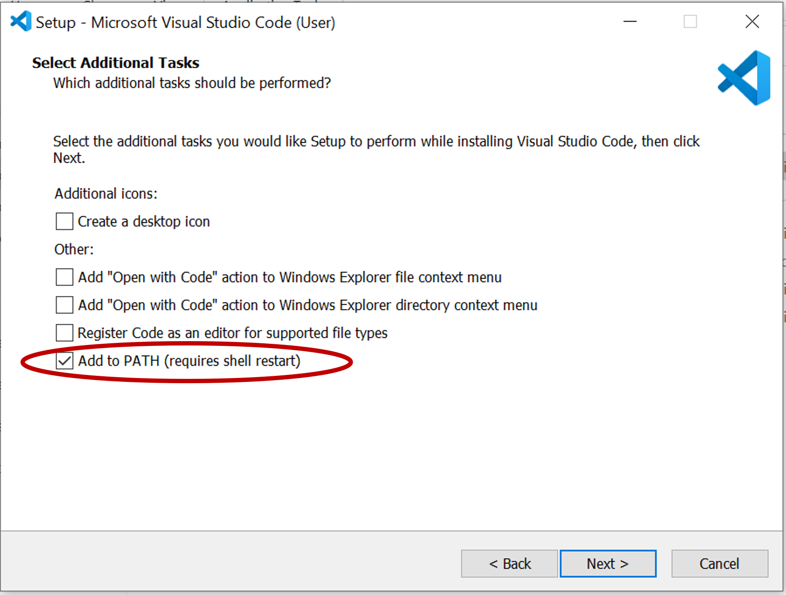
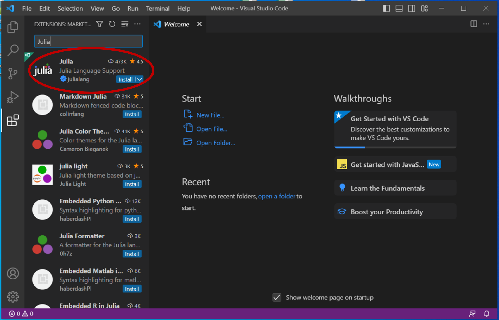

# Installation Guide

This page proposes a step by step installation guide to use the OptiPlantPtX tool. 

In short:
1. Fork the repository
2. Clone the repository to your local machine
3. Open in VS Code
4. Setup Julia Environment

Done! Try to run some of the examples following the user-guide

## 1. Fork the repository

Set up a [GitHub account](https://github.com/signup) and sign-in.
On the online repository, click on **Fork >  Create a new fork** and name it as you wish i.e. `OptiPlantPtX`.

## 2. Clone the repository to your local machine

Install a Git client (choose one you’re comfortable with):  
- [GitHub Desktop](https://desktop.github.com/) (recommended for beginners)  
- [Git](https://git-scm.com/downloads)  

### Steps (with GitHub Desktop):
1. On the OptiPlantPtX repository that you forked, click on the green "<> Code" button, go to HTTPS and copy the URL
2. In GitHub desktop, go to `File > Clone repository` 
3. Go in the URL tab and paste the OptiPlant repository URL
4. Choose the path to clone the repository locally: **installing on a Drive may cause problems!**  

## 3. Open in VS Code

Download and install [Visual Studio Code](https://code.visualstudio.com/). 
Make sure to select the "Add to PATH" option when installing. 



1. Open VS Code  
2. Go to `File > Open Folder` → select your `OptiPlantPtX` folder  

## 4. Setup Julia Environment

1. Make sure you have the **latest Julia version** installed: [Install Julia](https://julialang.org/install/).

2. Add the *Julia* extension in VS Code using the "Extensions: Marketplace" (access on the square icon on left sidebar of VS Code)
   

3. Open the Julia REPL inside VS Code (the first time opening can take a bit of time):  
   - Option 1, keyboard shortcut: Press `Alt + J` then `Alt + O` 
   - Option 2, open the command palette (`Ctrl+Shift+P`) and run: `Julia: Start REPL`


4. This is now a condensed version of the [Julia documentation](https://pkgdocs.julialang.org/v1/environments/) to use someone else's project:
   - In the REPL, run this comand to move one directory up (where the folder where `OptiPlantPtX` is located):  
   ```julia
   cd("..")
   ```
   - Press `]` to enter the package manager

   - To set up the environment write:
   ```julia
   activate OptiPlantPtX 
   ```
   !!! warning
       If your folder is called differently i.e. "MyOptiPlant" write `activate MyOptiPlant` instead

   Then write: 
   ```julia
   instantiate
   ```

5. To use Gurobi as a solver, you need to [install the software](https://www.gurobi.com/downloads/) and activate your license using the grbgetkey. Overtime, you may need to update Gurobi to the latest version and re-generate your license to avoid license compatibility issues.

6. Done! You can exit the package manager pressing the `Backspace key` and start running the examples from the user-guide.