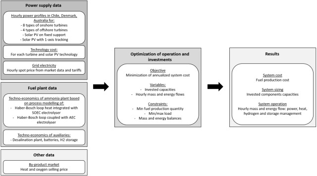

# About OptiPlantPtX

OptiPlantPtX is fast-solving open-source model for dynamic power-to-X plant techno-economic analysis. The model is a least-cost optimisation of investments and operation-costs, taking as input techno-economic data, varying power profiles and hourly grid prices.

The system’s optimization model has the following specifications:

**Input parameters**: the techno-economic data of the different units, the hourly grid electricity prices, the hourly renewable power production profiles, lifecycle assessment of the different units, hourly environmental impact of grid usage, renewable fuel certification rules, taxes and incentives, financial parameters

**Objective**: minimize the annualized system cost of the PtX power plant, using as variables the invested capacities and the hourly mass/energy flows. The system is constrained by a minimum fuel production quantity (annual or periodic), the min/max load of the different units and the mass/energy balances between the different units.

**Results**: fuel production cost, the sizing of the different units of the system and the operation of the system (in terms of mass and energy flows), environmental impacts

