# Usage Guide

## File Structure

OptiPlant has two main folders:
- **BASE**: Contains Data and Results
- **RUN CODE**: Contains Julia scripts

## Input Data

### Excel Files

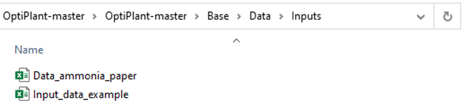

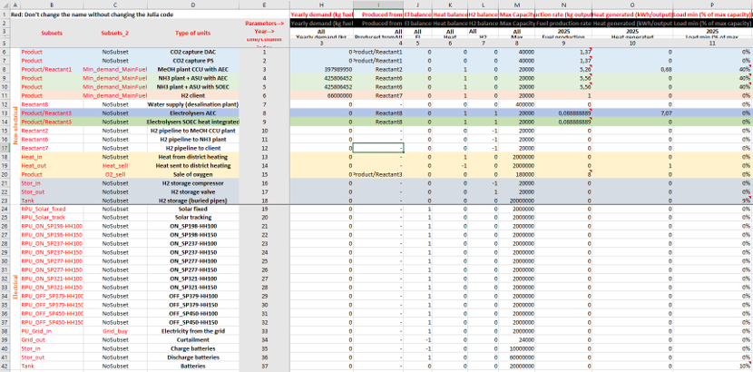

### Unit Selection

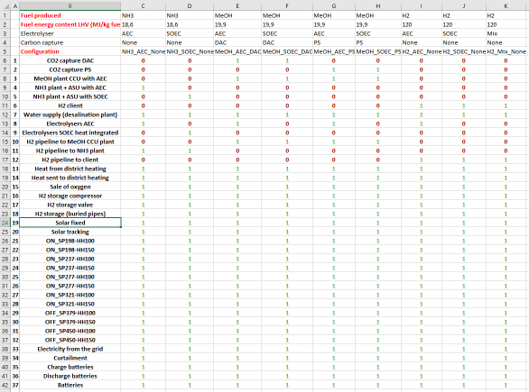

### Scenarios

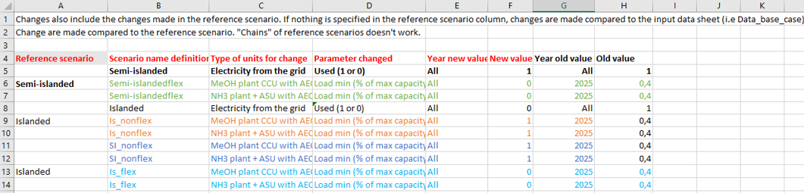

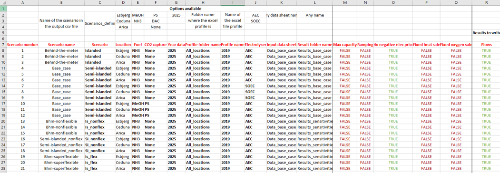

### Sources

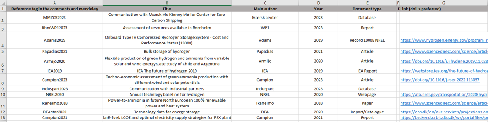

## Profiles

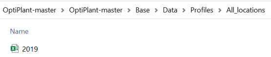

### Wind and Solar Data

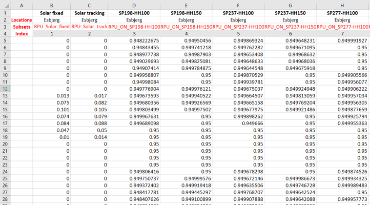

### Electricity Prices

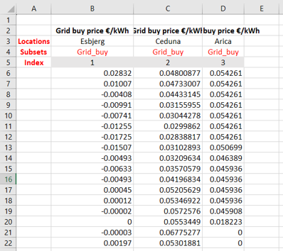

## Results

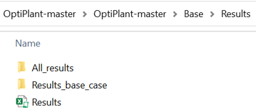

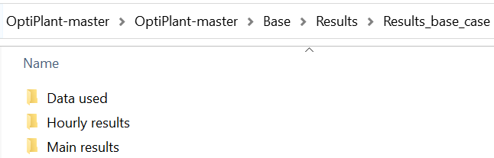

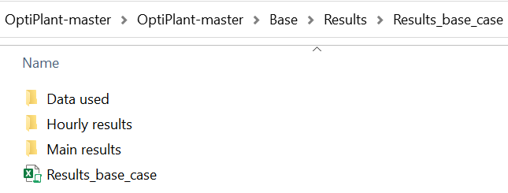

### Import Results

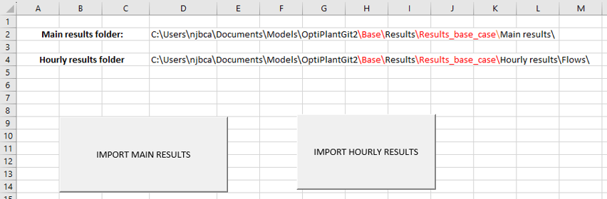

### Analysis

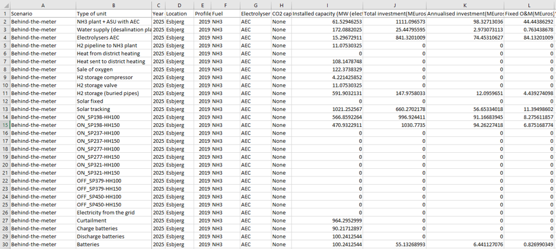

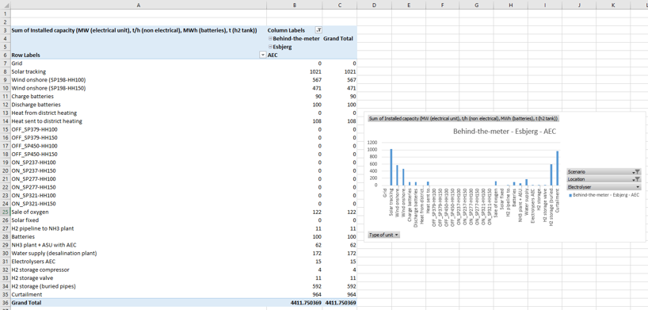

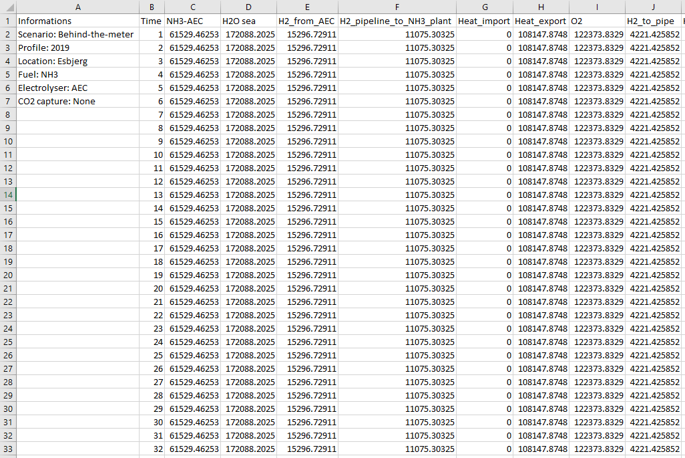

## Running the Model

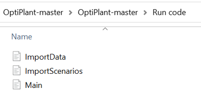

### Configuration

Set solver on line 4:

Set directories on lines 22-25:

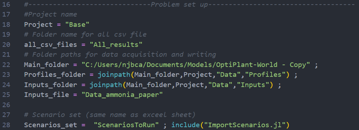