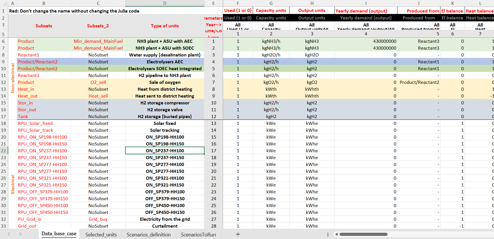
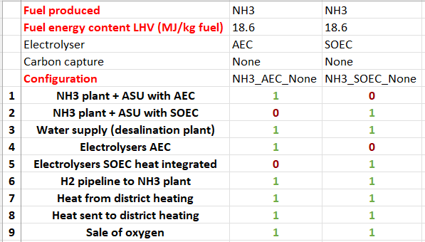
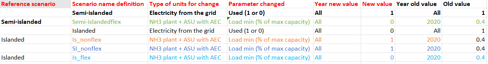
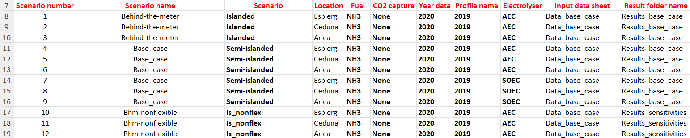
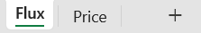
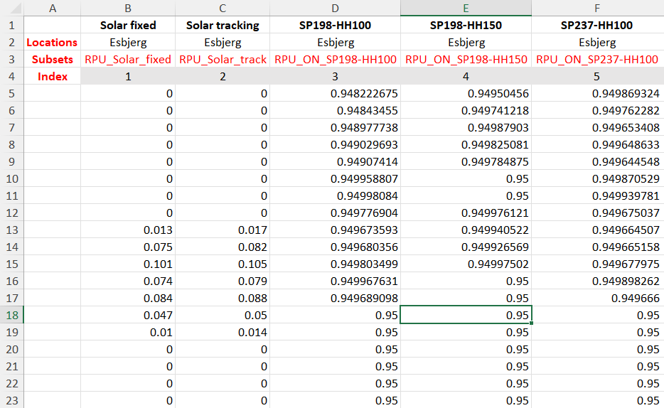
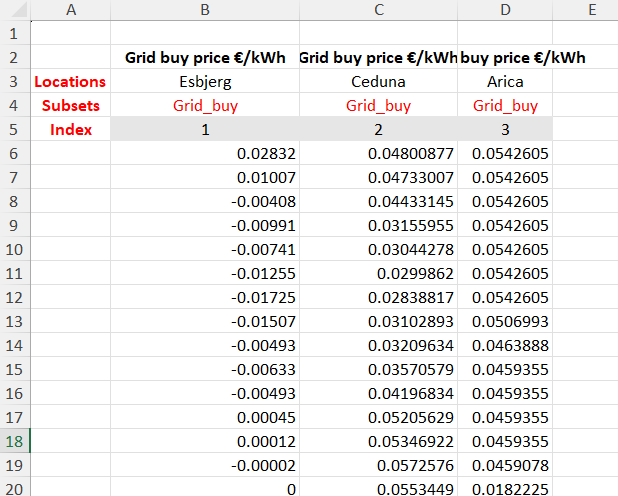
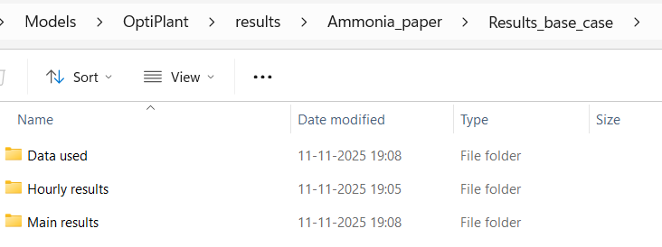

# User guide

All of the important files to run the model are in the `data` folder.

To create your own analysis **copy one of the existing folder and rename it to your convenience**.

Let's use the `data/Ammonia_paper` folder as an example.

## Data folder content

The data folder has two main folders:
- **model_inputs**: Contains or one more excel files with techno-economic data and study-case scenarios information
- **profiles**: Contains every time dynamic inputs (typically electricity prices, renewable power supply or grid CO2e emissions). Some subfolders can be used to organize the profiles folder and be called accordingly in the input excel file (see the `data/Full_model` for example). 

## Model inputs

The excel file inside the `model_input` is the main "workplace" to run the tool.

In general be especially cautious on writing the name for the different cell’s inputs correctly to avoid errors.

In the `Ammonia_paper` folder, the current file is called *Data_ammonia_paper.xlsx*.
The excel document has the following sheets:


The purpose of each sheet is described below:

### Data_base_case

This sheet includes a list of the different units that can constitute the PtX plant and their characteristics: production rates, heat and electrical flows, load ranges, ramp up/down times, CapEx and OpEx, etc… These are user defined and can be completely changed if needed (but everything works also without changing anything)



Adding a new technology can be done by inserting a line and fill up all the parameters.
New technologies associated with a profile also requires to be added in the profile folder.

Warning: Avoid changing the cells in red! The julia code identify the position of some column based on the names in red. These can be changed but the `src/ReadData/user_defined` files shouls also be modified accordingly.

### Selected units

This sheet contains a list of the different units and technologies that can constitute the PtX plant and the ones that are ..used for each fuel production process -i.e. NH3, H2, MeOH, etc.- For each case, a 1 implies that the unit is considered in the PtX plant and ..a 0 implies that it is not.



The number of lines and names should be exactly the same as in the Data_base_case sheet (so remember to also update this file when adding a new technology).

It is also possible to use an automatic unit filter based on the unit names, and exclude some specific units manually if needed (see the file in `Full_model` for an example).

### Scenario definition

This sheet is used to define different scenarios or sensitivities by modifying specific values in the *Data_base_case sheet* before running the optimization.

Each modification has to be associated with a name (Scenario name definition), that can be called when running a chain of scenarios.

The reference scenario can be used to include the changes from a previously defined scenario.



For example, in the image, *Is_nonflex* scenario uses the *Islanded* scenario as reference scenario, meaning that that the *electricity from the grid - used (1 or 0)* parameters will be set at 0 instead of 1 PLUS the *NH3 plant - Load min* will be set at 1 instead of 0.4 in the original *Data_base_case* sheet.

"Chains" of references does not work, meaning that *Is_nonflex* can not be used as a reference scenario (because it's already using a the *Islanded* reference scenario). 

### Scenarios to run

This sheet is used to list the different scenarios to be run through the optimization model. The conditions and characteristics of each of the listed scenarios make reference to the other sheets in the same excel document or to the profile folder. One can set the scenario parameters such as: operating strategy, location wind/solar data, year data, produced fuel, electrolyzer technology, etc. The output results of the model are going to be stored as CSV files in a ``results`` folder (the folder is automatically created).



For more advanced analysis, more scenario columns can be added (see ``Full_model`` for complete features).

The *Scenario* columns refers to the scenarios defined in the *Scenarios_definition* sheet. Scenario name, is the name of scenario that will appear in the result file after running OptiPlantPtX.

## Profiles

In the `Ammonia_paper` folder, the current profile file is called *2019.xlsx*.
The excel document has the following sheets:



The purpose of each sheet is described below:

### Flux

This sheet contains the normalized output power of solar and wind technologies for the year 2019 (which is an "average" year) in different locations. 



In this example, the solar/wind power profiles included in the Flux excel sheet are extracted from the [CorRES tool](https://corres.windenergy.dtu.dk/) (for wind profiles), and from [renewables.ninja website](https://www.renewables.ninja/) (for solar profiles).

It is important that the **Subsets** of the profile technologies matches with the ones from the *Data_base_case* data sheet. So each profile will be associated to the correct power generation technologies.

Having technologies in the *Data_base_case* data sheet not associated to a specific profile will lead to an error.

### Price

This sheet contains the hourly electricity spot price for the year 2019 at different locations. Similarly, the subset *grid_buy* should match with the in the *Data_base_case* sheet (for the grid electricity).



It is also possible to add timeseries for electricity sale and/or hourly heat bying or selling.

Adding a selling option is possible only if the maximum amount of electricity that can be sold is fixed. It is recommended to avoid selling electricity in the model and include electricity sale of curtailed electricity in post-calculation.

It is recommended to remove negative electricity prices using the option "No negative prices" in the scenario sheet. Otherwise, the model will face some infeasibilities. The sale of electricity at a negative price can easily be done as a post-calculation (but will likely not change the results much).

## Running the model

Running the model can be done running one of the scripts in the `examples` folder (for example *Run ammonia.jl*) using the function ``run_optimization_scenarios`` with the following arguments as minimum:

```julia
using OptiPlanPtX

run_optimization_scenarios(
        datafoldername = "Ammonia_paper", #Name of the folder with all the data
        techno_eco_filename = "Data_ammonia_paper", #Techno-economic and scenario file name
        scenario_set = "ScenariosToRun", #Sheet name with the scenarios list
        solver = "HiGHS", # Solver name (HiGHS or Gurobi)
        scenarios_to_run = 1:18; #Specific numbers of scenarios to run one after the other
        save_input_profiles = true, #Save the profile input files in the results folder
        save_input_technoeco =  true) #Save the techno-economic data files used in the results folder

```
## Checking the results

All results are saved in a folder that has the same name as the data folder (i.e. ``Ammonia_paper``). Results subfolders have been user-defined the *Techno-economic and scenarios* excel file (`Data_ammonia_paper.xlsx`) in the *ScenariosToRun* sheet.

These folders always contains subfolders named ’Data used’, ’Hourly results’, and ’Main results’, that include the inputs and results of the simulation in CSV files.



The method to process the results is quite free.

This can be done with the excel file and pivot charts provided on the GitHub or using the interactive data dashboard coming with OptiPlantPtX.

